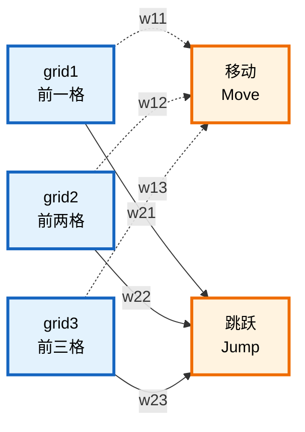
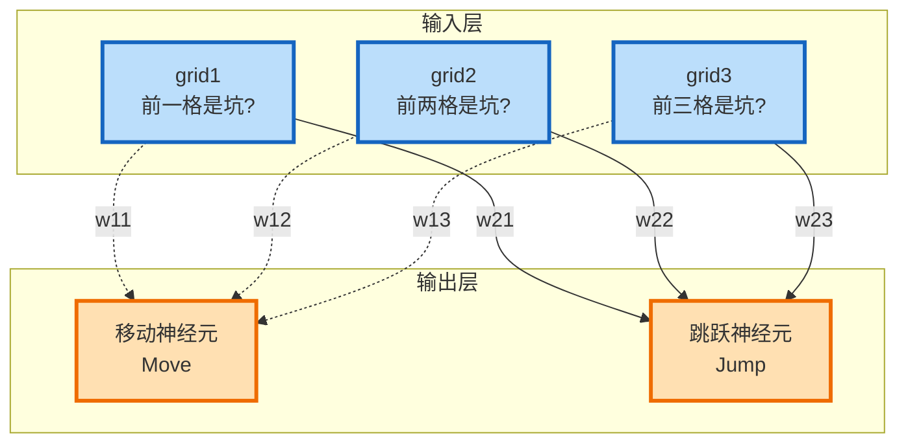
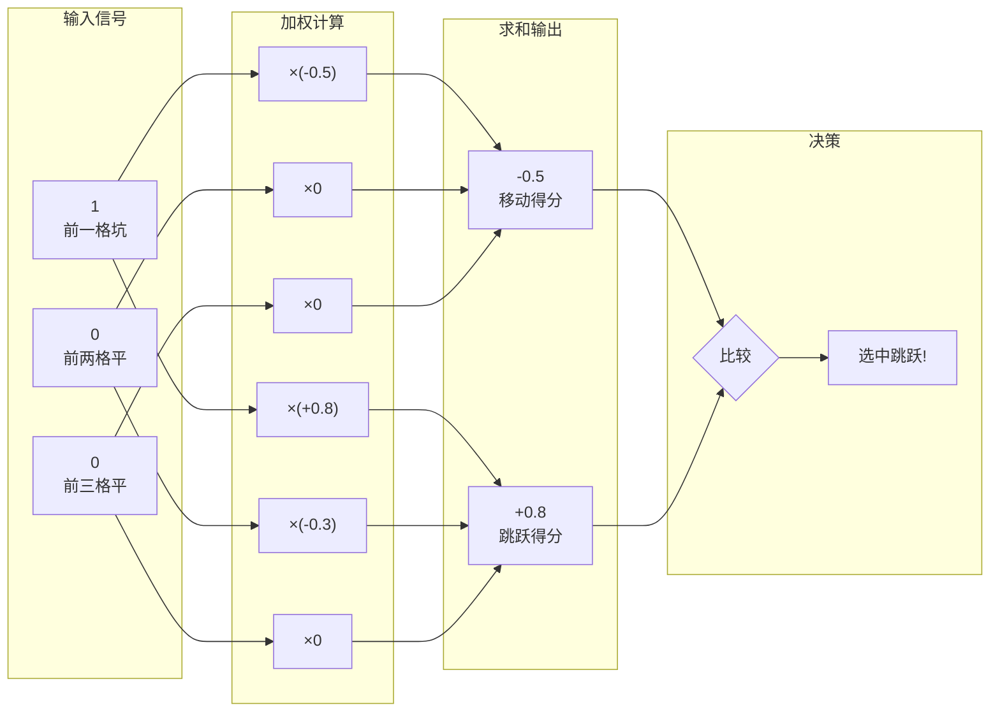

# 双输出神经网络结构

## 网络拓扑图（Mermaid）



## 另一种布局（上下结构，更像神经网络）



## 权重矩阵可视化

```
                    输出层
              ┌─────────┬─────────┐
              │  移动   │  跳跃   │
              │  Move   │  Jump   │
    ┌─────────┼─────────┼─────────┤
    │ grid1   │   w11   │   w21   │
输入│ 前一格  │  ─────  │  ─────  │
    ├─────────┼─────────┼─────────┤
    │ grid2   │   w12   │   w22   │
层  │ 前两格  │  ─────  │  ─────  │
    ├─────────┼─────────┼─────────┤
    │ grid3   │   w13   │   w23   │
    │ 前三格  │  ─────  │  ─────  │
    └─────────┴─────────┴─────────┘
```

## 信号流动示例

**输入**: `[1, 0, 0]` (前一格是坑)

**权重** (训练后):
```
w11=-0.5  w12=0.0   w13=0.0   (给移动的)
w21=+0.8  w22=-0.3  w23=0.0   (给跳跃的)
```

**计算过程**:



## 完整计算流程

### 1. 加权求和
```javascript
移动得分 = grid1×w11 + grid2×w12 + grid3×w13
        = 1×(-0.5) + 0×0 + 0×0 
        = -0.5

跳跃得分 = grid1×w21 + grid2×w22 + grid3×w23
        = 1×0.8 + 0×(-0.3) + 0×0
        = 0.8
```

### 2. 纯贪心决策
```javascript
if (跳跃得分 > 移动得分) 
    选择跳跃  // 0.8 > -0.5 ✓
else 
    选择移动
```

### 3. 探索模式（可选）
```javascript
// Softmax转概率
expMove = Math.exp(-0.5) = 0.606
expJump = Math.exp(0.8) = 2.225
total = 2.831

moveProb = 21.4%
jumpProb = 78.6%

// 按概率随机选
if (Math.random() < 0.1) {
    // 10%完全随机
} else if (Math.random() < moveProb) {
    选择移动  // 21.4%
} else {
    选择跳跃  // 78.6%
}
```

## 网络结构代码骨架

```javascript
class NeuralNetwork {
    constructor() {
        // 6个权重，全部初始化为0
        this.weights = {
            move: [0, 0, 0],  // w11, w12, w13
            jump: [0, 0, 0]   // w21, w22, w23
        };
    }
    
    // 前向传播：输入3个格子状态，输出动作
    decide(grid1, grid2, grid3) {
        const input = [grid1, grid2, grid3];
        
        // 计算两个得分
        const moveScore = this._dotProduct(input, this.weights.move);
        const jumpScore = this._dotProduct(input, this.weights.jump);
        
        // 纯贪心：选得分高的
        return jumpScore > moveScore ? 'jump' : 'move';
    }
    
    // 点积计算：a·b = a1×b1 + a2×b2 + a3×b3
    _dotProduct(a, b) {
        return a[0]*b[0] + a[1]*b[1] + a[2]*b[2];
    }
}
```

## 与单输出的对比

| 特性 | 单输出 (3→1) | 双输出 (3→2) ✓ |
|:----:|:------------:|:--------------:|
| 图示 | 3条线 | **6条线（全连接）** |
| 权重数 | 3个 | 6个 |
| 决策逻辑 | `跳跃概率>0.5?` | `跳跃得分>移动得分?` |
| 灵活性 | 隐含对立 | 独立学习 |
| 可视化 | 简单 | **交叉全连接** |

**双输出结构是标准神经网络结构，每个输入与每个输出全连接。**
