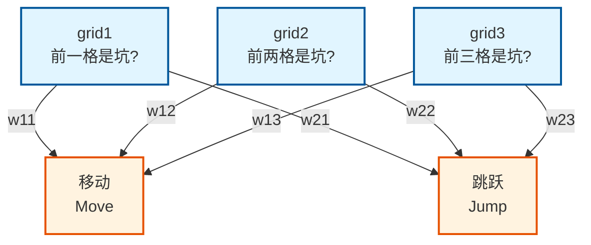

# 双输出神经网络结构

## 网络拓扑图



## 权重矩阵表示

| 输入 | 移动权重 | 跳跃权重 |
|:----:|:--------:|:--------:|
| grid1 (前一格) | w11 | w21 |
| grid2 (前两格) | w12 | w22 |
| grid3 (前三格) | w13 | w23 |

**总共6个权重**

## 计算流程

### Step 1: 计算两个得分

```javascript
moveScore = grid1 × w11 + grid2 × w12 + grid3 × w13
jumpScore = grid1 × w21 + grid2 × w22 + grid3 × w23
```

**实例**：输入 `[1, 0, 0]`（前一格是坑）

假设训练后的权重：
```
w11 = -0.5  (看到前一格坑，不想移动)
w12 = 0.0
w13 = 0.0

w21 = +0.8  (看到前一格坑，想跳跃)
w22 = -0.3  (看到前两格坑，不想跳)
w23 = 0.0
```

计算：
```
moveScore = 1×(-0.5) + 0×0 + 0×0 = -0.5
jumpScore = 1×0.8 + 0×(-0.3) + 0×0 = 0.8
```

### Step 2: Softmax转概率

```javascript
expMove = Math.exp(-0.5) = 0.606
expJump = Math.exp(0.8) = 2.225
total = 0.606 + 2.225 = 2.831

moveProb = 0.606 / 2.831 = 21.4%
jumpProb = 2.225 / 2.831 = 78.6%
```

### Step 3: 决策

**纯贪心（确定性）**：
```javascript
if (jumpScore > moveScore) return 'jump';
// 0.8 > -0.5，选跳跃 ✓
```

**带探索（概率性）**：
```javascript
if (Math.random() < 0.9) {
    // 90%按概率选
    if (Math.random() < moveProb) return 'move';  // 21.4%概率进这里
    else return 'jump';  // 78.6%概率进这里
} else {
    // 10%完全随机
    return Math.random() < 0.5 ? 'move' : 'jump';
}
```

## 可视化理解

### 权重可视化（训练后）

```
输入: [1, 0, 0] (前一格是坑)

到移动的连接:
  grid1 --(-0.5)--> 移动    [弱激活]
  grid2 --( 0.0)--> 移动    [无]
  grid3 --( 0.0)--> 移动    [无]
  
到跳跃的连接:
  grid1 --(+0.8)--> 跳跃    [强激活]  ← 这个决定结果
  grid2 --(-0.3)--> 跳跃    [弱抑制]
  grid3 --( 0.0)--> 跳跃    [无]
  
结果: 跳跃得分 > 移动得分 → 选择跳跃
```

### 信号流动图

```
grid1=1 ──┬─[-0.5]─→ ┌─────────┐
          │          │ 移动    │ ← 得分-0.5 → 概率21%
grid2=0 ──┼─[ 0.0]─→ │ 神经元  │
          │          └────┬────┘
grid3=0 ──┤               │ 比较
          │          ┌────┴────┐
          │          │ 跳跃    │ ← 得分+0.8 → 概率79%
          └─[+0.8]─→ │ 神经元  │ ← 选中！
          │          └─────────┘
          └─[-0.3]─→ (grid2不影响，因为是0)
```

## 与单输出的区别

| 特性 | 单输出 (3→1) | 双输出 (3→2) |
|:----:|:------------:|:------------:|
| 权重数 | 3个 | 6个 |
| 计算方式 | 只算跳跃概率 | 分别算两个得分 |
| 决策逻辑 | 跳跃概率>0.5? | 跳跃得分>移动得分? |
| 灵活性 | 低（隐含对立） | 高（独立学习） |
| 可视化 | 3条线 | 6条线（每个输入连两个输出） |

## 代码骨架

```javascript
class NeuralNetwork {
    constructor() {
        // 6个权重，初始为0
        // w11, w12, w13: 输入到移动
        // w21, w22, w23: 输入到跳跃
        this.weights = {
            move: [0, 0, 0],   // [w11, w12, w13]
            jump: [0, 0, 0]    // [w21, w22, w23]
        };
    }
    
    // 前向传播：返回动作
    decide(grid1, grid2, grid3) {
        const input = [grid1, grid2, grid3];
        
        // 计算两个得分
        const moveScore = this._dotProduct(input, this.weights.move);
        const jumpScore = this._dotProduct(input, this.weights.jump);
        
        // 纯贪心：选大的
        return jumpScore > moveScore ? 'jump' : 'move';
    }
    
    // 点积计算
    _dotProduct(a, b) {
        return a[0]*b[0] + a[1]*b[1] + a[2]*b[2];
    }
}
```

---

*双输出结构比单输出更标准，每个动作独立学习自己的权重。*
